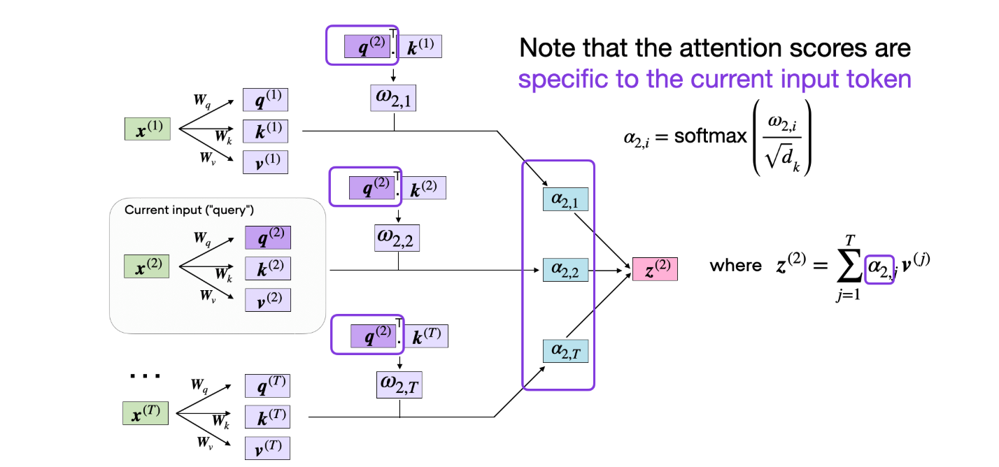

# ml_learning_note
random ML reading notes
1. Hidden Markov Model
    - youtube [playlist](https://www.youtube.com/playlist?list=PLix7MmR3doRo3NGNzrq48FItR3TDyuLCo)
2. deep RL(感觉有些吃力）
    - youtube [playlist](https://www.youtube.com/watch?v=2GwBez0D20A&list=PLwRJQ4m4UJjNymuBM9RdmB3Z9N5-0IlY0)
3. 自注意力机制
    - https://sebastianraschka.com/blog/2023/self-attention-from-scratch.html
<details>

自注意力机制的核心是让每个输入元素（如单词、token或像素）根据其与序列中其他元素的关系，计算一个加权表示。这种机制能够捕捉序列中远距离的依赖关系，而不像传统的循环神经网络（RNN）那样受限于顺序处理或固定上下文。

- **“自”注意力**：指的是每个输入元素会根据自身与其他所有元素的关联性，动态调整注意力权重。
- **动态关注**：模型可以根据任务需要，关注序列中任意位置的信息，而不是仅限于邻近的元素。

### **工作原理**
自注意力机制通过以下步骤计算：

#### （1）**输入表示**
假设输入是一个序列 $X = [x_1, x_2, ..., x_n]$，其中 $x_i$ 是每个元素的向量表示（例如，词嵌入）。每个 $x_i$ 是一个 $d$ 维向量。

#### （2）**计算查询、键和值（Query, Key, Value）**
自注意力机制引入了三个可学习的矩阵，用于将输入向量投影到不同的子空间：
- **查询向量（Query, Q）**：表示当前元素“询问”其他元素的信息。
- **键向量（Key, K）**：表示其他元素是否与当前元素相关。
- **值向量（Value, V）**：包含实际的信息内容。

这些向量通过线性变换得到：

$Q = XW_Q, \quad K = XW_K, \quad V = XW_V$

其中，$W_Q$, $W_K$, $W_V$ 是可学习的权重矩阵，形状为$d \times d_k$（或 $d \times d_v$），$Q, K, V$ 的形状为 $n \times d_k$或$n \times d_v$。

#### （3）**计算注意力权重**
注意力权重是通过查询和键的点积计算的，衡量每个输入元素与其他元素的相关性：
$\text{Attention Scores} = \frac{QK^T}{\sqrt{d_k}}$
- $QK^T$  是形状为 $n \times n$ 的矩阵，表示每个元素对其他元素的“相似度”。
- 除以 $\sqrt{d_k}$ 是缩放点积注意力（Scaled Dot-Product Attention）的关键步骤，用于避免点积值过大导致梯度消失。

接着，通过 Softmax 函数将这些分数归一化为权重：
$\text{Attention Weights} = \text{Softmax}\left(\frac{QK^T}{\sqrt{d_k}}\right)$

#### （4）**加权求和**
使用注意力权重对值向量 \( V \) 进行加权求和，得到每个输入元素的上下文表示：
$\text{Output} = \text{Attention Weights} \cdot V$
输出是一个新的序列 $Z = [z_1, z_2, ..., z_n]$，每个 $z_i$ 是输入序列中所有值的加权组合，反映了当前元素对其他元素的关注程度。

==> $\text{Attention}(Q, K, V) = \text{softmax}\left( \frac{Q K^T}{\sqrt{d_k}} \right) V$


</details>

4. Transformer 资料
- https://courses.grainger.illinois.edu/ece537/fa2022/slides/lec23.pdf 课件
- https://sebastianraschka.com/blog/2023/self-attention-from-scratch.html
- https://jalammar.github.io/illustrated-transformer/
- https://zhuanlan.zhihu.com/p/338817680 （只有过程 没有说明为什么）
- https://hackmd.io/@abliu/BkXmzDBmr （台大的Li教授视频讲的有点散）
- http://nlp.seas.harvard.edu/annotated-transformer/

5. 高斯过程
- https://zhuanlan.zhihu.com/p/75589452 （非常有帮助）
- [An Intuitive Tutorial to Gaussian Process Regression](https://arxiv.org/abs/2009.10862)
- https://fanpu.io/blog/2025/gaussian-processes/
- [Gaussian Processes in Machine Learning](https://mlg.eng.cam.ac.uk/pub/pdf/Ras04.pdf)
- [Gaussian Processes as a Statistical Method - slides](https://sites.stat.columbia.edu/liam/teaching/compstat-spr25/cunningham.pdf)
- https://d2l.ai/chapter_gaussian-processes/gp-intro.html
- https://peterroelants.github.io/posts/gaussian-process-tutorial/ (I like python codes there)
- https://peterroelants.github.io/posts/gaussian-process-kernel-fitting/
- https://peterroelants.github.io/posts/gaussian-process-kernels/

<details>
最重要的几个概念是

- 当从函数的视角去看待采样，每次采样无限维相当于采样一个函数之后，原本的概率密度函数不再是点的分布 ，而变成了函数的分布。这个无限元高斯分布即称为高斯过程。
- 高斯过程正式地定义为：对于任意有限输入点集 $\mathbf{x} = {x_1, x_2, \dots, x_n}$，函数值向量 $f(\mathbf{x}) = [f(x_1), f(x_2), \dots, f(x_n)]^\top$ 都服从多元高斯分布，则称函数 $f$ 是一个高斯过程，表示为
$$f(\mathbf{x}) \sim \mathcal{GP}\bigl(m(\mathbf{x}), k(\mathbf{x}, \mathbf{x}')\bigr)$$
其中：

$m(\mathbf{x}) = \mathbb{E}[f(\mathbf{x})]$ 表示均值函数（Mean function），返回各输入点的期望值；
$k(\mathbf{x}, \mathbf{x}') = \operatorname{Cov}[f(\mathbf{x}), f(\mathbf{x}')]$ 为协方差函数（Covariance Function，也称核函数 Kernel Function），返回两组输入点之间的协方差矩阵。 一个高斯过程由均值函数和协方差函数唯一确定，并且其任意有限维子集都服从多元高斯分布（例如二元高斯分布中，两个维度各自服从一元高斯分布，且具有相关性）。
标准多元高斯形式：
对于输入点 $\mathbf{x} \in \mathbb{R}^{n \times d}$，有
$$f(\mathbf{x}) \sim \mathcal{N}\bigl(\mathbf{m}, \mathbf{K}\bigr)$$
其中：

$\mathbf{m}_i = m(x_i)$
$\mathbf{K}_{ij} = k(x_i, x_j)$

示例：零均值高斯过程（常见简化）
若均值函数为零，则简化为
$$f(\mathbf{x}) \sim \mathcal{GP}\bigl(0, k(\mathbf{x}, \mathbf{x}')\bigr)$$

- 核函数（协方差函数）

核函数是一个高斯过程的核心，核函数决定了一个高斯过程的性质。核函数在高斯过程中起生成一个协方差矩阵（相关系数矩阵）来衡量任意两个点之间的“距离”。不同的核函数有不同的衡量方法，得到的高斯过程的性质也不一样。最常用的一个核函数为高斯核函数，也成为径向基函数Radial Basis Function, RBF。其基本形式如下
核函数是一个高斯过程的核心，核函数决定了一个高斯过程的性质。核函数在高斯过程中起生成一个协方差矩阵（相关系数矩阵）来衡量任意两个点之间的“距离”。不同的核函数有不同的衡量方法，得到的高斯过程的性质也不一样。最常用的一个核函数为**高斯核函数**†，也成为径向基函数↑RBF。其基本形式如下。其中 $\sigma$ 和 $l$ 是高斯核的超参数。

$$
K(x_i, x_j) = \sigma^2 \exp\left( -\frac{\|x_i - x_j\|_2^2}{2l^2} \right)
$$

> **参数解释**：
> - $\sigma^2$：信号方差，控制函数波动幅度；
> - $l$：长度尺度，控制函数变化的快慢（$l$ 越大越平滑）。

```code
def exponentiated_quadratic(xa, xb):
    """Exponentiated quadratic  with σ=1"""
    # L2 distance (Squared Euclidian)
    sq_norm = -0.5 * scipy.spatial.distance.cdist(xa, xb, 'sqeuclidean')
    return np.exp(sq_norm)
```
- GP 回归：从先验到后验
1. 观测模型（带噪声）
我们观测到 $ n $ 个点：
$$\mathbf{y} = f(\mathbf{X}) + \epsilon, \quad \epsilon \sim \mathcal{N}(0, \sigma_n^2)$$
即：
$$\mathbf{y} \mid f \sim \mathcal{N}(f(\mathbf{X}), \sigma_n^2 \mathbf{I})$$
2. 先验（零均值）
$$f(\cdot) \sim \mathcal{GP}(0, k(\cdot, \cdot))
\Rightarrow
\begin{bmatrix}
f(\mathbf{X}) \\
f(\mathbf{X}_*)
\end{bmatrix}
\sim
\mathcal{N}\left(
\mathbf{0},
\begin{bmatrix}
\mathbf{K}_{XX} & \mathbf{K}_{X*} \\
\mathbf{K}_{*X} & \mathbf{K}_{**}
\end{bmatrix}
\right)$$
其中：

$$ \mathbf{K}_{XX} = k(\mathbf{X}, \mathbf{X}) $$
$$ \mathbf{K}{X*} = k(\mathbf{X}, \mathbf{X}*) $$
$$ \mathbf{K}{**} = k(\mathbf{X}, \mathbf{X}_) $$


联合分布（含噪声）
由于 $ \mathbf{y} = f(\mathbf{X}) + \epsilon $，联合分布为：
$$\begin{bmatrix}
\mathbf{y} \\
f_*
\end{bmatrix}
\sim
\mathcal{N}\left(
\mathbf{0},
\begin{bmatrix}
\mathbf{K}_{XX} + \sigma_n^2 \mathbf{I} & \mathbf{K}_{X*} \\
\mathbf{K}_{*X} & \mathbf{K}_{**}
\end{bmatrix}
\right)$$

3. 条件分布 → 后验分布（核心推导）
我们要计算：
$$p(f_* \mid \mathbf{X}_*, \mathbf{X}, \mathbf{y})$$
由多元高斯分布的条件性质：
若联合分布：
$$\begin{bmatrix}
\mathbf{a} \\ \mathbf{b}
\end{bmatrix}
\sim \mathcal{N}(\boldsymbol{\mu}, \boldsymbol{\Sigma})
\quad \text{with} \quad
\boldsymbol{\Sigma} = 
\begin{bmatrix}
\boldsymbol{\Sigma}_{aa} & \boldsymbol{\Sigma}_{ab} \\
\boldsymbol{\Sigma}_{ba} & \boldsymbol{\Sigma}_{bb}
\end{bmatrix}$$
则：
$$\mathbf{b} \mid \mathbf{a} \sim \mathcal{N}\left(
\boldsymbol{\mu}_b + \boldsymbol{\Sigma}_{ba} \boldsymbol{\Sigma}_{aa}^{-1} (\mathbf{a} - \boldsymbol{\mu}_a),
\;
\boldsymbol{\Sigma}_{bb} - \boldsymbol{\Sigma}_{ba} \boldsymbol{\Sigma}_{aa}^{-1} \boldsymbol{\Sigma}_{ab}
\right)$$

代入 GP 回归

$$ \mathbf{a} = \mathbf{y} $$
$$ \mathbf{b} = f_* $$
$$ \boldsymbol{\mu}_a = \boldsymbol{\mu}_b = 0 $$
$$ \boldsymbol{\Sigma}{aa} = \mathbf{K}{XX} + \sigma_n^2 \mathbf{I} $$
$$ \boldsymbol{\Sigma}{ab} = \mathbf{K}{X*} $$
$$ \boldsymbol{\Sigma}{ba} = \mathbf{K}{X} = \mathbf{K}_{X}^T $$
$$ \boldsymbol{\Sigma}{bb} = \mathbf{K}{**} $$


后验均值
$$\boxed{
\bar{f}_* = \mathbf{K}_{*X} (\mathbf{K}_{XX} + \sigma_n^2 \mathbf{I})^{-1} \mathbf{y}
}$$
后验协方差
$$\boxed{
\text{Cov}(f_*) = \mathbf{K}_{**} - \mathbf{K}_{*X} (\mathbf{K}_{XX} + \sigma_n^2 \mathbf{I})^{-1} \mathbf{K}_{X*}
}$$

4 噪声-free 情况（插值）
若 $ \sigma_n^2 = 0 $（无噪声）, 则后验均值：$$ \bar{f}* = \mathbf{K}{*X} \mathbf{K}_{XX}^{-1} \mathbf{y} $$
若 $ \mathbf{X}* $ 包含训练点 → $ \bar{f}* = \mathbf{y} $ → 精确插值

- 超参数优化

上文提到高斯过程是一种非参数模型，没有训练模型参数的过程，一旦核函数、训练数据给定，则模型就被唯一地确定下来。但是核函数本身是有参数的，比如高斯核的参数$\sigma$ 和 $l$ ，我们称为这种参数为模型的超参数（类似于 k-NN 模型中 k 的取值）。超参数优化是最大化在这两个超参数下观测数据出现的概率，通过最大化**边缘对数似然（Marginal Log-Likelihood）** 来找到最优参数，边缘对数似然表示为：

$$
\log p(\mathbf{y} \mid \mathbf{X}, \boldsymbol{\theta})
= -\frac{1}{2} \mathbf{y}^\top \mathbf{K}_{\boldsymbol{\theta}}^{-1} \mathbf{y}
  -\frac{1}{2} \log \det(\mathbf{K}_{\boldsymbol{\theta}})
  -\frac{n}{2} \log (2\pi)
$$

其中：

- $\mathbf{y} \in \mathbb{R}^n$：观测目标值；
- $\mathbf{X} \in \mathbb{R}^{n \times d}$：**输入特征矩阵（必须有！）**；
- $\boldsymbol{\theta} = \{\sigma^2, l\}$（或包含噪声 $\sigma_n^2$）：**超参数集合**；
- $\mathbf{K}_{\boldsymbol{\theta}} = K(\mathbf{X}, \mathbf{X}; \boldsymbol{\theta}) + \sigma_n^2 \mathbf{I}$：**核矩阵**，由 $\mathbf{X}$ 和 $\boldsymbol{\theta}$ 共同决定。
> 注：$\boldsymbol{\theta}$ 是超参数的**向量表示**，比单独写 $\sigma, l$ 更通用、清晰。

具体的实现中，我们在 `fit` 方法中增加超参数优化这部分的代码 最小化负边缘对数似然。用gradient descent
- 高斯过程的核心性质

A finite dimensional subset of the Gaussian process distribution results in a marginal distribution that is a Gaussian distribution with mean vector $\mu$, covariance matrix $K$


$$
f(\mathbf{x}) \sim \mathcal{GP}\bigl(m(\mathbf{x}), k(\mathbf{x}, \mathbf{x}')\bigr)
$$

任意 $n$ 个点的函数值服从多元高斯

$$
\boxed{
\begin{bmatrix}
f(x_1) \\ \vdots \\ f(x_n)
\end{bmatrix}
\sim
\mathcal{N}\left(
\begin{bmatrix}
m(x_1) \\ \vdots \\ m(x_n)
\end{bmatrix},
\;
\begin{bmatrix}
k(x_1,x_1) & \cdots & k(x_1,x_n) \\
\vdots & \ddots & \vdots \\
k(x_n,x_1) & \cdots & k(x_n,x_n)
\end{bmatrix}
\right)
}
$$

这就是 **“finite dimensional subset” → “marginal Gaussian”** 的数学本质。
Think of a GP like an infinite-dimensional Gaussian random vector.
When you pick any finite number of coordinates, what you get is a finite-dimensional Gaussian — with mean and covariance given by the corresponding entries.
This is exactly how multivariate Gaussians work
 - GP回归过程总结
 1. 定义核函数 k(x,x'; θ)
 2. 给定训练数据 (X, y)
 3. 计算 K_XX, K_X*, K_**
 4. 计算后验均值和协方差
 5. 优化 θ 最大化 log p(y|X,θ)
 6. 预测新点 X*

| 项目           | 公式                                                                 |
|----------------|----------------------------------------------------------------------|
| **先验**       | $ f \sim \mathcal{GP}(0, k) $                                    |
| **联合分布**   | $ \begin{bmatrix} \mathbf{y} \\ f_* \end{bmatrix} \sim \mathcal{N}\left(0, \begin{bmatrix} K + \sigma_n^2 I & K_{X*} \\ K_{*X} & K_{**} \end{bmatrix}\right) $ |
| **后验均值**   | $ \bar{f}_* = K_{*X} (K_{XX} + \sigma_n^2 I)^{-1} \mathbf{y} $   |
| **后验协方差** | $ \Sigma_* = K_{**} - K_{*X} (K_{XX} + \sigma_n^2 I)^{-1} K_{X*} $ |
| **带噪声的训练点协方差矩阵** | $ K_y = K_{XX} + \sigma_n^2 I$|, $ \sigma_n^2 $：观测噪声方差
| **对数边缘似然** | $ \log p(\mathbf{y} \mid \theta) = -\frac{1}{2} \left[ \mathbf{y}^T K_y^{-1} \mathbf{y} + \log \lvert K_y \rvert + n \log 2\pi \right] $|

 
</details>
