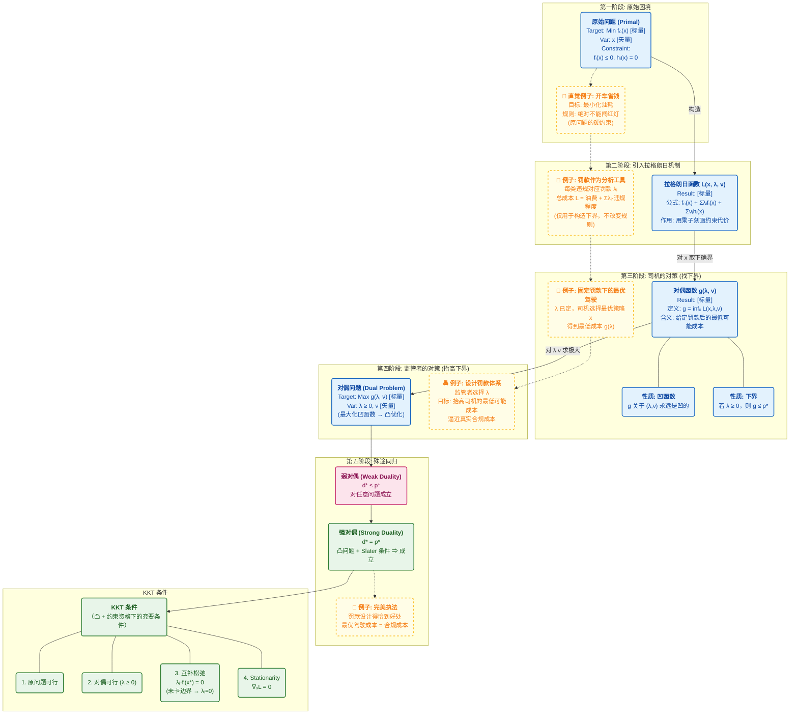

```mermaid
graph TD
    %% --- 样式定义 ---
    classDef math fill:#e3f2fd,stroke:#1565c0,stroke-width:2px,color:#0d47a1;
    classDef example fill:#fffde7,stroke:#fbc02d,stroke-width:2px,stroke-dasharray: 5 5,color:#f57f17;
    classDef result fill:#e8f5e9,stroke:#2e7d32,stroke-width:2px,color:#1b5e20;
    classDef gap fill:#fce4ec,stroke:#c2185b,stroke-width:2px,color:#880e4f;

    %% --- 阶段 1 ---
    subgraph Stage1 ["第一阶段: 原始困境"]
        direction TB
        A("<b>原始问题 (Primal)</b><br>Target: Min f₀(x) [标量]<br>Var: x [矢量]<br>Constraint:<br>fᵢ(x) ≤ 0, hᵢ(x) = 0"):::math
        Ex1("<b>🚗 直觉例子: 开车省钱</b><br>目标: 最小化油耗<br>规则: 绝对不能闯红灯<br>(原问题的硬约束)"):::example
        A -.-> Ex1
    end

    %% --- 阶段 2 ---
    subgraph Stage2 ["第二阶段: 引入拉格朗日机制"]
        direction TB
        B("<b>拉格朗日函数 L(x, λ, ν)</b><br>Result: [标量]<br>公式: f₀(x) + Σλᵢfᵢ(x) + Σνᵢhᵢ(x)<br>作用: 用乘子刻画约束代价"):::math
        Ex2("<b>👮 例子: 罚款作为分析工具</b><br>每类违规对应罚款 λᵢ<br>总成本 L = 油费 + Σλᵢ·违规程度<br>(仅用于构造下界，不改变规则)"):::example
        
        A -->|构造| B
        Ex1 -.-> Ex2
    end

    %% --- 阶段 3 ---
    subgraph Stage3 ["第三阶段: 司机的对策 (找下界)"]
        direction TB
        C("<b>对偶函数 g(λ, ν)</b><br>Result: [标量]<br>定义: g = infₓ L(x,λ,ν)<br>含义: 给定罚款后的最低可能成本"):::math
        Ex3("<b>🚕 例子: 固定罚款下的最优驾驶</b><br>λ 已定，司机选择最优策略 x<br>得到最低成本 g(λ)"):::example
        
        Prop1("<b>性质: 凹函数</b><br>g 关于 (λ,ν) 永远是凹的"):::math
        Prop2("<b>性质: 下界</b><br>若 λ ≥ 0，则 g ≤ p*"):::math

        B -->|对 x 取下确界| C
        Ex2 -.-> Ex3
        C --- Prop1 & Prop2
    end

    %% --- 阶段 4 ---
    subgraph Stage4 ["第四阶段: 监管者的对策 (抬高下界)"]
        direction TB
        D("<b>对偶问题 (Dual Problem)</b><br>Target: Max g(λ, ν) [标量]<br>Var: λ ≥ 0, ν [矢量]<br>(最大化凹函数 → 凸优化)"):::math
        Ex4("<b>🚔 例子: 设计罚款体系</b><br>监管者选择 λ<br>目标: 抬高司机的最低可能成本<br>逼近真实合规成本"):::example

        C -->|对 λ,ν 求极大| D
        Ex3 -.-> Ex4
    end

    %% --- 阶段 5 ---
    subgraph Stage5 ["第五阶段: 殊途同归"]
        direction TB
        Weak("<b>弱对偶 (Weak Duality)</b><br>d* ≤ p*<br>对任意问题成立"):::gap
        Strong("<b>强对偶 (Strong Duality)</b><br>d* = p*<br>凸问题 + Slater 条件 ⇒ 成立"):::result
        
        Ex5("<b>🤝 例子: 完美执法</b><br>罚款设计得恰到好处<br>最优驾驶成本 = 合规成本"):::example

        D --> Weak
        Weak --> Strong
        Strong -.-> Ex5
    end

    %% --- KKT 条件 ---
    subgraph Final ["KKT 条件"]
        direction TB
        KKT("<b>KKT 条件</b><br>（凸 + 约束资格下的充要条件）"):::result
        K1("1. 原问题可行"):::result
        K2("2. 对偶可行 (λ ≥ 0)"):::result
        K3("3. 互补松弛<br>λᵢ·fᵢ(x*) = 0<br>(未卡边界 → λᵢ=0)"):::result
        K4("4. Stationarity<br>∇ₓL = 0"):::result
        
        Strong --> KKT
        KKT --- K1 & K2 & K3 & K4
    end
```