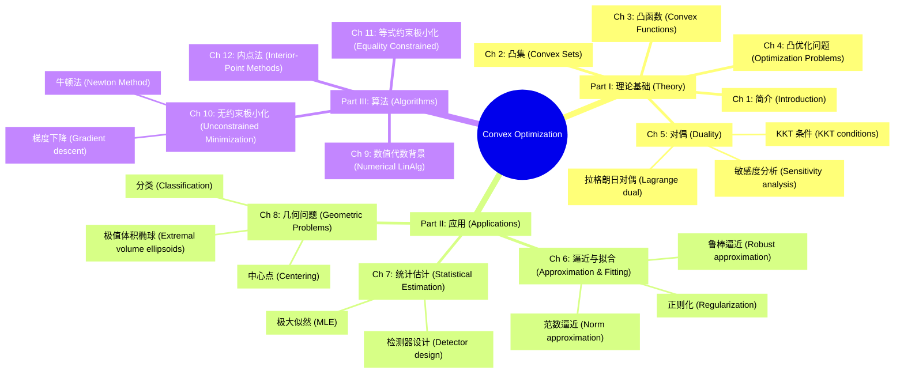

```mermaid
mindmap
  root((Convex Optimization))
    Theory["Part I: 理论基础 (Theory)"]
      Ch1["Ch 1: 简介 (Introduction)"]
      Ch2["Ch 2: 凸集 (Convex Sets)"]
      Ch3["Ch 3: 凸函数 (Convex Functions)"]
      Ch4["Ch 4: 凸优化问题 (Optimization Problems)"]
      Ch5["Ch 5: 对偶 (Duality)"]
        Ch5_1["拉格朗日对偶 (Lagrange dual)"]
        Ch5_2["KKT 条件 (KKT conditions)"]
        Ch5_3["敏感度分析 (Sensitivity analysis)"]
    Applications["Part II: 应用 (Applications)"]
      Ch6["Ch 6: 逼近与拟合 (Approximation & Fitting)"]
        Ch6_1["范数逼近 (Norm approximation)"]
        Ch6_2["正则化 (Regularization)"]
        Ch6_3["鲁棒逼近 (Robust approximation)"]
      Ch7["Ch 7: 统计估计 (Statistical Estimation)"]
        Ch7_1["极大似然 (MLE)"]
        Ch7_2["检测器设计 (Detector design)"]
      Ch8["Ch 8: 几何问题 (Geometric Problems)"]
        Ch8_1["极值体积椭球 (Extremal volume ellipsoids)"]
        Ch8_2["中心点 (Centering)"]
        Ch8_3["分类 (Classification)"]
    Algorithms["Part III: 算法 (Algorithms)"]
      Ch9["Ch 9: 数值代数背景 (Numerical LinAlg)"]
      Ch10["Ch 10: 无约束极小化 (Unconstrained Minimization)"]
        Ch10_1["梯度下降 (Gradient descent)"]
        Ch10_2["牛顿法 (Newton Method)"]
      Ch11["Ch 11: 等式约束极小化 (Equality Constrained)"]
      Ch12["Ch 12: 内点法 (Interior-Point Methods)"]
```