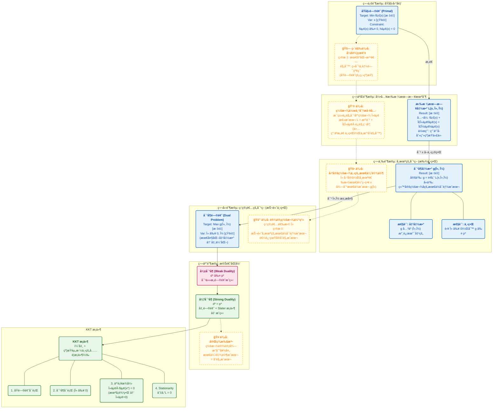

```mermaid
graph TD
    %% --- æ ·å¼å®šä¹‰ ---
    classDef math fill:#e3f2fd,stroke:#1565c0,stroke-width:2px,color:#0d47a1;
    classDef example fill:#fffde7,stroke:#fbc02d,stroke-width:2px,stroke-dasharray: 5 5,color:#f57f17;
    classDef result fill:#e8f5e9,stroke:#2e7d32,stroke-width:2px,color:#1b5e20;
    classDef gap fill:#fce4ec,stroke:#c2185b,stroke-width:2px,color:#880e4f;

    %% --- 阶段 1 ---
    subgraph Stage1 ["第一阶段: åŸå§‹å›°å¢ƒ"]
        direction TB
        A("<b>åŸå§‹é—®é¢˜ (Primal)</b><br>Target: Min fâ‚€(x) [æ ‡é‡]<br>Var: x [矢é‡]<br>Constraint:<br>fáµ¢(x) ≤ 0, háµ¢(x) = 0"):::math
        Ex1("<b>🚗 直觉例å­: 开车çœé’±</b><br>目标: 最å°åŒ–油耗<br>规则: ç»å¯¹ä¸èƒ½é—¯çº¢ç¯<br>(åŸé—®é¢˜çš„硬约æŸ)"):::example
        A -.-> Ex1
    end

    %% --- 阶段 2 ---
    subgraph Stage2 ["第二阶段: 引入拉格朗日机制"]
        direction TB
        B("<b>拉格朗日函数 L(x, λ, ν)</b><br>Result: [æ ‡é‡]<br>å…¬å¼: fâ‚€(x) + Σλᵢfáµ¢(x) + Σνᵢháµ¢(x)<br>作用: 用乘å­åˆ»ç”»çº¦æŸä»£ä»·"):::math
        Ex2("<b>👮 例å­: 罚款作为分æ工具</b><br>æ¯ç±»è¿è§„对应罚款 λᵢ<br>总æˆæœ¬ L = 油费 + Σλᵢ·è¿è§„程度<br>(仅用äºæ„造下界，ä¸æ”¹å˜è§„则)"):::example
        
        A -->|æ„造| B
        Ex1 -.-> Ex2
    end

    %% --- 阶段 3 ---
    subgraph Stage3 ["第三阶段: å¸æœºçš„对策 (找下界)"]
        direction TB
        C("<b>对å¶å‡½æ•° g(λ, ν)</b><br>Result: [æ ‡é‡]<br>定义: g = infâ‚“ L(x,λ,ν)<br>å«ä¹‰: 给定罚款å的最ä½å¯èƒ½æˆæœ¬"):::math
        Ex3("<b>🚕 例å­: 固定罚款下的最优驾驶</b><br>λ 已定，å¸æœºé€‰æ‹©æœ€ä¼˜ç­–ç•¥ x<br>得到最ä½æˆæœ¬ g(λ)"):::example
        
        Prop1("<b>性质: 凹函数</b><br>g å…³äº (λ,ν) 永远是凹的"):::math
        Prop2("<b>性质: 下界</b><br>若 λ ≥ 0，则 g ≤ p*"):::math

        B -->|对 x å–下确界| C
        Ex2 -.-> Ex3
        C --- Prop1 & Prop2
    end

    %% --- 阶段 4 ---
    subgraph Stage4 ["第四阶段: 监管者的对策 (抬高下界)"]
        direction TB
        D("<b>对å¶é—®é¢˜ (Dual Problem)</b><br>Target: Max g(λ, ν) [æ ‡é‡]<br>Var: λ ≥ 0, ν [矢é‡]<br>(最大化凹函数 → 凸优化)"):::math
        Ex4("<b>🚔 例å­: 设计罚款体系</b><br>监管者选择 λ<br>目标: 抬高å¸æœºçš„最ä½å¯èƒ½æˆæœ¬<br>逼近真å®åˆè§„æˆæœ¬"):::example

        C -->|对 λ,ν 求æ大| D
        Ex3 -.-> Ex4
    end

    %% --- 阶段 5 ---
    subgraph Stage5 ["第五阶段: 殊途åŒå½’"]
        direction TB
        Weak("<b>å¼±å¯¹å¶ (Weak Duality)</b><br>d* ≤ p*<br>对任æ„问题æˆç«‹"):::gap
        Strong("<b>å¼ºå¯¹å¶ (Strong Duality)</b><br>d* = p*<br>凸问题 + Slater æ¡ä»¶ ⇒ æˆç«‹"):::result
        
        Ex5("<b>🤠例å­: 完ç¾æ‰§æ³•</b><br>罚款设计得æ°åˆ°å¥½å¤„<br>最优驾驶æˆæœ¬ = åˆè§„æˆæœ¬"):::example

        D --> Weak
        Weak --> Strong
        Strong -.-> Ex5
    end

    %% --- KKT æ¡ä»¶ ---
    subgraph Final ["KKT æ¡ä»¶"]
        direction TB
        KKT("<b>KKT æ¡ä»¶</b><br>（凸 + 约æŸèµ„格下的充è¦æ¡ä»¶ï¼‰"):::result
        K1("1. åŸé—®é¢˜å¯è¡Œ"):::result
        K2("2. 对å¶å¯è¡Œ (λ ≥ 0)"):::result
        K3("3. 互补æ¾å¼›<br>λᵢ·fáµ¢(x*) = 0<br>(未å¡è¾¹ç•Œ → λᵢ=0)"):::result
        K4("4. Stationarity<br>∇ₓL = 0"):::result
        
        Strong --> KKT
        KKT --- K1 & K2 & K3 & K4
    end
```