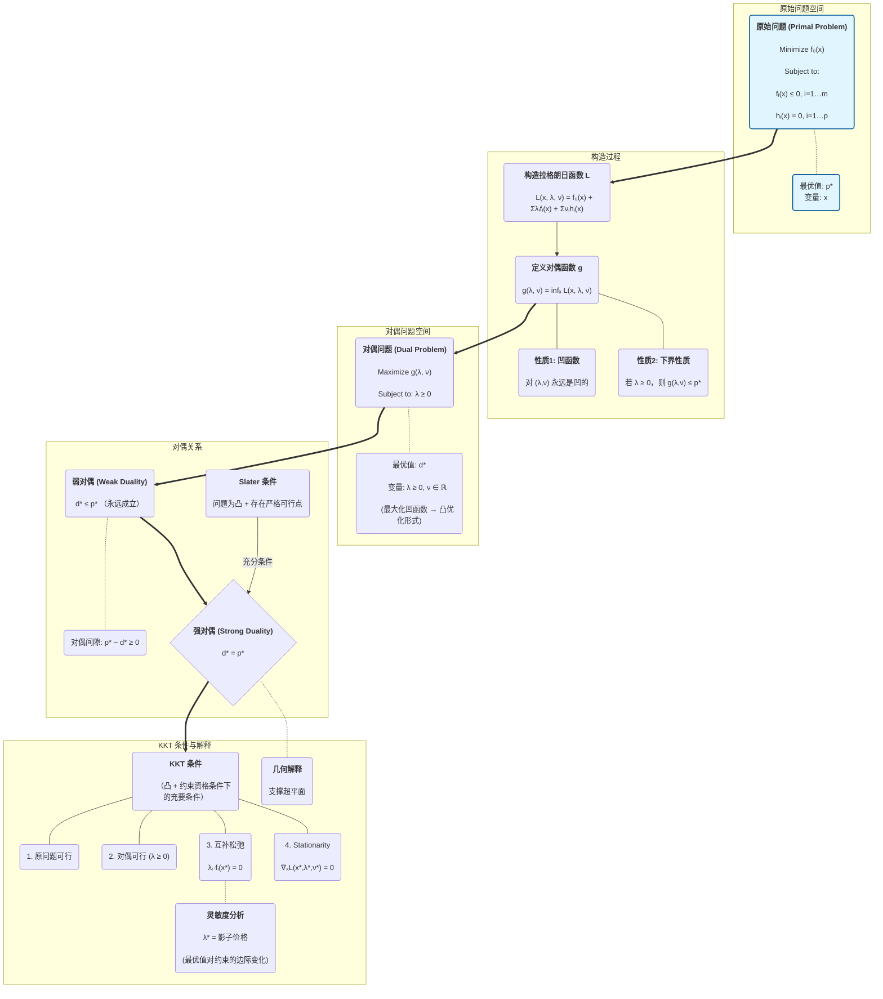

# 对偶理论思维导图（Mermaid）

```mermaid
---
config:
  layout: dagre
---
flowchart TB
 subgraph S1["原始问题空间"]
    direction TB
        A("<b>原始问题 (Primal Problem)</b><br>
        Minimize f₀(x)<br>
        Subject to:<br>
        fᵢ(x) ≤ 0, i=1…m<br>
        hᵢ(x) = 0, i=1…p")
        A_Prop("最优值: p*<br>变量: x")
  end

 subgraph S2["构造过程"]
    direction TB
        B("<b>构造拉格朗日函数 L</b><br>
        L(x, λ, ν) = f₀(x) + Σλᵢfᵢ(x) + Σνᵢhᵢ(x)")
        C("<b>定义对偶函数 g</b><br>
        g(λ, ν) = infₓ L(x, λ, ν)")
        C_Prop1("<b>性质1: 凹函数</b><br>
        对 (λ,ν) 永远是凹的")
        C_Prop2("<b>性质2: 下界性质</b><br>
        若 λ ≥ 0，则 g(λ,ν) ≤ p*")
  end

 subgraph S3["对偶问题空间"]
    direction TB
        D("<b>对偶问题 (Dual Problem)</b><br>
        Maximize g(λ, ν)<br>
        Subject to: λ ≥ 0")
        D_Prop("最优值: d*<br>
        变量: λ ≥ 0, ν ∈ ℝ<br>
        (最大化凹函数 → 凸优化形式)")
  end

 subgraph S4["对偶关系"]
    direction TB
        E("<b>弱对偶 (Weak Duality)</b><br>
        d* ≤ p* （永远成立）")
        Gap("对偶间隙: p* − d* ≥ 0")
        F{"<b>强对偶 (Strong Duality)</b><br>
        d* = p*"}
        Slater("<b>Slater 条件</b><br>
        问题为凸 + 存在严格可行点")
  end

 subgraph S5["KKT 条件与解释"]
    direction TB
        KKT("<b>KKT 条件</b><br>
        （凸 + 约束资格条件下的充要条件）")
        K1("1. 原问题可行")
        K2("2. 对偶可行 (λ ≥ 0)")
        K3("3. 互补松弛<br>
        λᵢ·fᵢ(x*) = 0")
        K4("4. Stationarity<br>
        ∇ₓL(x*,λ*,ν*) = 0")
        Sens("<b>灵敏度分析</b><br>
        λ* = 影子价格<br>
        (最优值对约束的边际变化)")
        Geo("<b>几何解释</b><br>
        支撑超平面")
  end

    A -.- A_Prop
    A ==> B
    B --> C
    C --- C_Prop1 & C_Prop2
    C ==> D
    D -.- D_Prop
    D ==> E
    E -.- Gap
    Slater -- 充分条件 --> F
    E ==> F
    F ==> KKT
    KKT --- K1 & K2 & K3 & K4
    K3 -.- Sens
    F -.- Geo

     A:::primal
     A_Prop:::primal
     B:::concept
     C:::concept
     C_Prop1:::concept
     C_Prop2:::concept
     D:::dual
     D_Prop:::dual
     E:::concept
     Gap:::concept
     F:::bridge
     Slater:::bridge
     KKT:::bridge
     K1:::bridge
     K2:::bridge
     K3:::bridge
     K4:::bridge
     Sens:::concept
     Geo:::concept

    classDef primal fill:#e1f5fe,stroke:#01579b,stroke-width:2px,color:#01


```

